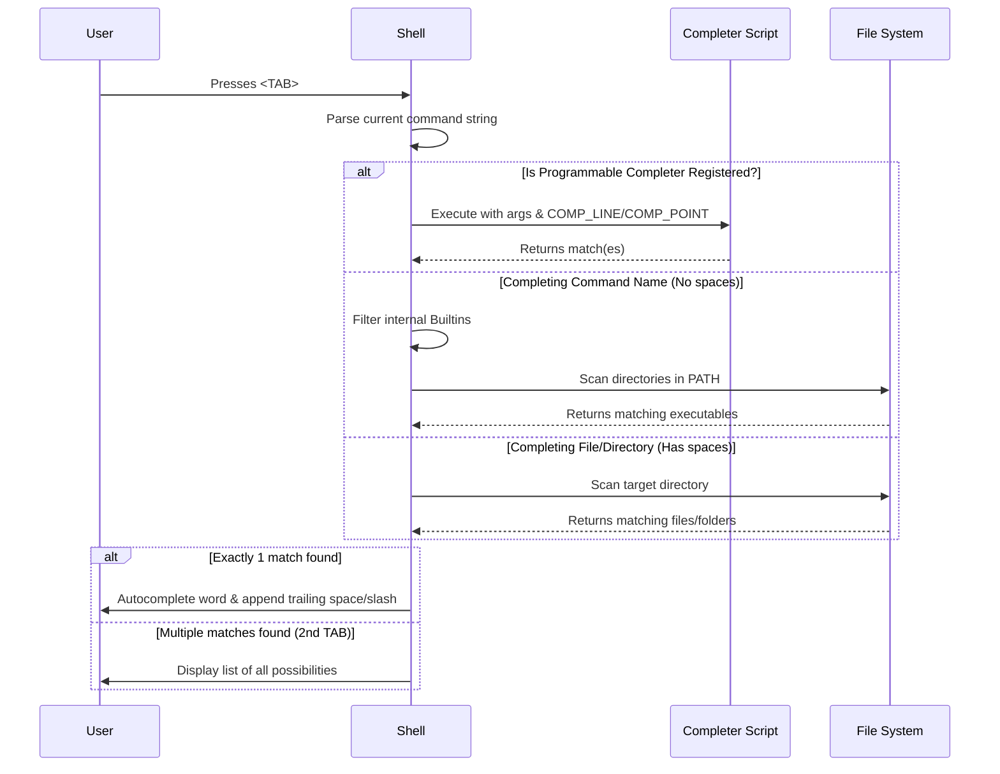
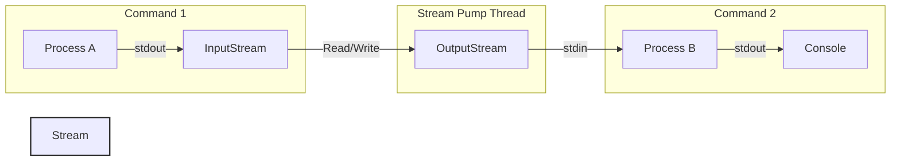

# 🐚 Custom Java Shell

A fully functional, interactive shell built from scratch in Java. This shell supports advanced features like pipes, redirection, background jobs, raw terminal input handling, and a sophisticated programmable auto-completion system.

## 🌟 Key Features

*   **Interactive REPL:** Built with custom character-by-character input using raw terminal mode (`stty -icanon -echo`) to intercept keystrokes in real-time.
*   **Builtin Commands:** Supports standard builtins including `cd`, `pwd`, `echo`, `type`, `exit`, `jobs`, and `complete`.
*   **Programmable Autocompletion:** Supports advanced `bash`-style completion. You can register custom completer scripts (`complete -C script cmd`) that the shell invokes with standard environment variables (`COMP_LINE`, `COMP_POINT`).
*   **Pipes & Redirection:** Full support for `|`, `>`, `>>`, `1>`, `2>`, `2>>` to chain commands and redirect standard output/error to files.
*   **Background Jobs:** Run long-running processes in the background using `&` and track them with the `jobs` command.
*   **Executable Resolution:** Dynamically searches the `PATH` environment variable to find and execute binaries.

---

## 🏗️ Architecture Diagrams

### 1. The Core REPL & Execution Loop

This flowchart visualizes the core architecture of the shell, from raw character input to command execution.

```mermaid
graph TD
    A([Start Shell]) --> B[Set Terminal to Raw Mode]
    B --> C((Print Prompt $))
    C --> D[Read Char from System.in]
    D --> E{Is Key?}
    
    E -- "TAB (\t)" --> F[Autocomplete Engine]
    F --> D
    
    E -- "Normal Char" --> H[Append to Buffer]
    H --> D
    
    E -- "Enter (\n)" --> I[Parse Command Line]
    
    I --> J{Contains Pipe | ?}
    J -- Yes --> K[Execute Pipeline Segments]
    
    J -- No --> L[Handle Redirections >, 2>]
    L --> M{Is Builtin?}
    
    M -- Yes --> N[Execute Builtin Command]
    M -- No --> O[Resolve executable in PATH]
    O --> P[Spawn Process]
    
    K --> Q[Check Background Jobs Status]
    N --> Q
    P --> Q
    
    Q --> C
```

### 2. The Autocompletion Engine

The autocomplete engine is one of the most complex parts of the shell. It determines the context of the user's input and routes it to the appropriate completion strategy.



### 3. Pipeline Execution Flow

Pipelines require orchestrating multiple asynchronous processes and stitching their inputs and outputs together using threads.



## 🚀 Getting Started

Ensure you have Java installed on your system.

```bash
# Compile the shell
javac src/main/java/Main.java

# Run the shell
java -cp src/main/java Main
```

## 🛠️ Technology Stack
*   **Language:** Java
*   **Dependencies:** None (Zero-dependency architecture)
*   **Concurrency:** Standard Java Threads for pipeline stream-pumping.
*   **System Calls:** Uses `Runtime.getRuntime().exec()` and `ProcessBuilder` for external execution.
